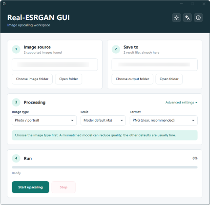
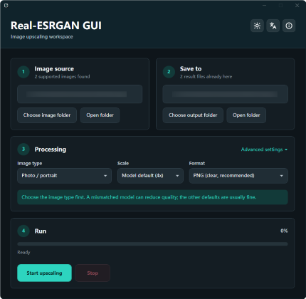

# Real-ESRGAN GUI

**Select your Language: English | [简体中文](README.zh-CN.md)**

## Introduction

Real-ESRGAN GUI is a Windows app for making images larger and sharper on your own PC. It uses the bundled Real-ESRGAN NCNN/Vulkan backend, but you do not need to type commands or install Python, PyTorch, CUDA, or the .NET Runtime.

The usual workflow is simple: choose an input folder, choose an output folder, pick the image type, then start. The app is meant for photos, portraits, anime images, illustrations, and animation frames.

Your images are processed locally. They are not uploaded to a cloud service.

## Screenshots

| Light theme | Dark theme |
| :---: | :---: |
| <a href="assets/screenshots/main-window-light.png"></a> | <a href="assets/screenshots/main-window-dark.png"></a> |
| [View original](assets/screenshots/main-window-light.png) | [View original](assets/screenshots/main-window-dark.png) |

## License and third-party notices

The original GUI, launcher, scripts, and repository-specific documentation in this repository are licensed under the MIT License. The app also bundles or distributes third-party components, including the Real-ESRGAN model files, the NCNN/Vulkan backend, .NET runtime files, and installer tooling. Those components keep their own licenses and attribution requirements.

See [`THIRD_PARTY_NOTICES.md`](THIRD_PARTY_NOTICES.md) and the [`licenses/`](licenses/) directory for the full third-party notices. Release packages include these notice files, and the app shows them in the About window.

## Download and install

These links always point to the latest release. If you are not sure which one to choose, download the first one.

| Your computer | Download |
| --- | --- |
| Windows 10/11, 64-bit | [Download installer for x64](https://github.com/Xeknoz/Real-ESRGAN-GUI/releases/latest/download/Real-ESRGAN-GUI-Setup-x64.exe) |
| Windows 10, 32-bit | [Download installer for x86](https://github.com/Xeknoz/Real-ESRGAN-GUI/releases/latest/download/Real-ESRGAN-GUI-Setup-x86.exe) |
| No-install copy on 64-bit Windows | [Download portable x64](https://github.com/Xeknoz/Real-ESRGAN-GUI/releases/latest/download/Real-ESRGAN-GUI-Portable-x64.exe) |
| No-install copy on 32-bit Windows | [Download portable x86](https://github.com/Xeknoz/Real-ESRGAN-GUI/releases/latest/download/Real-ESRGAN-GUI-Portable-x86.exe) |

You can also open the [latest release page](https://github.com/Xeknoz/Real-ESRGAN-GUI/releases/latest) to read the changelog and see all files.

Do not download "Source code (zip)" or "Source code (tar.gz)" if you only want to use the app. Those files are for developers and do not contain a ready-to-run GUI package.

## Check the downloaded file

This app is unsigned for now, so Windows may show "Unknown publisher" or a SmartScreen warning. That is expected for this release. Do not turn off Windows security; check the downloaded file first.

Quick check:

1. Download the installer or portable file from the latest Release.
2. Download [`SHA256SUMS.txt`](https://github.com/Xeknoz/Real-ESRGAN-GUI/releases/latest/download/SHA256SUMS.txt) from the same Release.
3. Open PowerShell in the folder where the downloaded file is saved, then run:

```powershell
Get-FileHash .\Real-ESRGAN-GUI-Setup-x64.exe -Algorithm SHA256
Get-Content .\SHA256SUMS.txt
```

4. Compare the long SHA256 value with the line for the same file name in `SHA256SUMS.txt`. If the values are different, delete the file and download it again.

This only checks that your local file matches the file published in the Release. It does not require an account.

For extra detail, [`release-manifest.json`](https://github.com/Xeknoz/Real-ESRGAN-GUI/releases/latest/download/release-manifest.json) lists the tag, commit, workflow run, file sizes, SHA256 hashes, and submodule revisions. If you already use GitHub CLI, you can also check the release provenance:

```powershell
gh attestation verify .\Real-ESRGAN-GUI-Setup-x64.exe -R Xeknoz/Real-ESRGAN-GUI
```

## Use the installer

1. Run `Real-ESRGAN-GUI-Setup-x64.exe`, or the x86 installer if you are on 32-bit Windows 10.
2. Follow the installer prompts.
3. Open Real-ESRGAN GUI from the Start menu or the desktop shortcut.

The installer includes the GUI, launcher, backend executable, .NET runtime files, models, and license notices.

## Use the single-file portable version

1. Download the single-file portable executable from the release page, such as `Real-ESRGAN-GUI-Portable-x64.exe`.
2. Run the executable directly from a normal folder.
3. Keep using the file from that folder. The app uses virtualized internal files and removes extracted temporary files when it exits.

## Quick start

1. Put the images you want to process in one folder.
2. Open Real-ESRGAN GUI.
3. Click `Choose image folder` and select the folder with your images.
4. Click `Choose output folder` and select where the results should be saved.
5. Pick the image type.
6. Keep the default settings for your first run.
7. Click `Start upscaling`.

If the input folder is empty, add images before starting. The app does not ship a sample input image.

## Settings

| Setting | Practical choice |
| --- | --- |
| Image type | Use Photo / portrait for real photos, Anime / illustration for drawings, and the anime video options for animation frames. |
| Scale | Keep Model default unless you specifically need 2x, 3x, or 4x output. |
| Format | Use PNG when you care most about preservation, JPG for smaller files, and WebP for web use. |
| Enhanced quality | Try a normal run first. Enhanced quality may improve some images, but it is slower. |
| Advanced settings | Keep threads and GPU on Auto unless you are troubleshooting a device problem. |

Supported input files: `png`, `jpg`, `jpeg`, `bmp`, `webp`, `tif`, `tiff`.

Supported output formats: `png`, `jpg`, `webp`.

## Notes for users

- The supported release targets are Windows 10/11 x64 and Windows 10 x86.
- Use x64 on 64-bit Windows. The x86 build has a much lower memory limit and is mainly for 32-bit Windows 10.
- A Vulkan-capable GPU and a current graphics driver are recommended because the backend uses NCNN/Vulkan.
- Very large images may take a long time or run out of GPU memory.
- The normal release entry is `Launcher.exe`. It shows the startup splash and opens the main GUI.

## Relationship to Real-ESRGAN

This repository is a Windows GUI distribution around the Real-ESRGAN NCNN/Vulkan backend. Upstream Real-ESRGAN also covers command-line use, Python workflows, model research, training, and standalone NCNN releases.

Useful upstream projects:

- [Real-ESRGAN](https://github.com/xinntao/Real-ESRGAN)
- [Real-ESRGAN-ncnn-vulkan](https://github.com/xinntao/Real-ESRGAN-ncnn-vulkan)

## Build from source

Basic build requirements:

- Windows 10/11 x64
- Git
- PowerShell 5.1 or newer
- .NET SDK 9
- Git submodules

Full release requirements:

- Visual Studio C++ Build Tools with x64 and x86 toolchains
- Windows SDK
- CMake 3.10 or newer
- Vulkan SDK. x86 builds need `Lib32\vulkan-1.lib`; `scripts/setup-vulkan-sdk.ps1 -RequireLib32` installs/selects an SDK with that component for CI.
- Inno Setup 6 if you want to build installers
- Enigma Virtual Box if you want to build single-file portable executables

Clone the repository and initialize the backend submodule:

```powershell
git clone --recursive https://github.com/Xeknoz/Real-ESRGAN-GUI.git
cd Real-ESRGAN-GUI
git submodule update --init --recursive
```

If you already cloned the repository without submodules, run only:

```powershell
git submodule update --init --recursive
```

Compile the WPF GUI project:

```powershell
dotnet build src/Real-ESRGAN-GUI/RealESRGAN-GUI.csproj
```

Build a portable x64 app folder:

```powershell
.\scripts\build-all.ps1 -Clean -Architecture x64
```

The output is written to:

```text
artifacts\portable\x64\
```

Build Enigma single-file portable executables:

```powershell
.\scripts\build-enigma.ps1 -Clean
```

By default this builds both release architectures. The script first builds or reuses rebuildable staging under `artifacts\intermediate\portable\<arch>\`, then packages each portable folder into:

```text
artifacts\portable-enigma\Real-ESRGAN-GUI-Portable-x64.exe
artifacts\portable-enigma\Real-ESRGAN-GUI-Portable-x86.exe
```

Pass `-Architecture x64` or `-Architecture x86` to build only one Enigma portable executable.

Build both release architectures and installers:

```powershell
.\scripts\build-release.ps1
```

Full release builds use `artifacts\intermediate\portable\<arch>\` as staging for installers and Enigma single-file portable executables. Use `-SkipInstaller` when you specifically want a ready-to-run portable folder under `artifacts\portable\<arch>\` for local testing.

Build only the portable folders, without installers:

```powershell
.\scripts\build-release.ps1 -SkipInstaller
```

Build release artifacts plus Enigma single-file portable executables:

```powershell
.\scripts\build-release.ps1 -BuildEnigma
```

Check the release upload assets after a release build:

```powershell
.\scripts\resolve-release-assets.ps1 -Clean -RequireInstallers -RequireEnigma
```

Release upload assets are the installer executables in `artifacts\installers\` and the Enigma single-file portable executables in `artifacts\portable-enigma\`. The check script prints those paths for upload and removes the legacy duplicate `artifacts\release-assets\` directory when `-Clean` is passed.

Generate release hashes and a machine-readable manifest:

```powershell
.\scripts\write-release-evidence.ps1 -RequireInstallers -RequireEnigma
```

The evidence files are written to `artifacts\release-evidence\SHA256SUMS.txt` and `artifacts\release-evidence\release-manifest.json`.

GitHub Actions publishes the same assets for numeric `v*` release tags such as `v1.0.1` or `v1.0.1.4`.

Build only one architecture:

```powershell
.\scripts\build-release.ps1 -Architecture x64
.\scripts\build-release.ps1 -Architecture x86
```

Useful focused commands:

```powershell
.\src\Launcher\build.ps1
.\scripts\build-backend.ps1 -Clean -Architecture x64
.\scripts\build-models.ps1
.\scripts\build-all.ps1 -Clean -ForceBackend
.\scripts\build-models.ps1 -Force
.\scripts\build-installer.ps1 -Clean -Architecture x64
.\scripts\build-enigma.ps1 -Clean
```

Generated files go under `artifacts\`:

```text
artifacts\
  backend\<arch>\engine\   Generated backend executable and runtime DLLs
  models\                  Generated NCNN model files shared by architectures
  portable\<arch>\         Ready-to-run portable app folder from build-all or -SkipInstaller
  portable-enigma\          Single-file portable executables built by Enigma Virtual Box
  intermediate\portable\<arch>\  Rebuildable staging for installers and Enigma
  intermediate\enigma-projects\  Rebuildable Enigma .evb intermediate projects
  installers\              Windows installers
```

The portable folder should contain `Launcher.exe`, `Real-ESRGAN GUI.exe`, `engine\realesrgan-ncnn-vulkan.exe`, model files under `engine\models\`, version markers, and license notices.

## Try a local build

To try the app after building from source, create both runnable portable folders:

```powershell
.\scripts\build-release.ps1 -SkipInstaller
```

This produces:

```text
artifacts\portable\x64\
artifacts\portable\x86\
```

Start each build through its launcher:

```powershell
.\artifacts\portable\x64\Launcher.exe
.\artifacts\portable\x86\Launcher.exe
```

If the current build output contains `NU1900`, the build may still create files, but NuGet did not finish checking dependency vulnerability information. For a build you plan to share with others, rerun with internet access:

```powershell
.\scripts\build-release.ps1 -SkipInstaller -ForceRestore
```

`-ForceRestore` is not an offline workaround; it only makes sense with internet access because it forces the build to fetch and check dependency information again.

## Agent Skill for Performance Traces

This repository publishes the [`skills/windows-wpf-trace-analysis`](skills/windows-wpf-trace-analysis/) Codex Skill for analyzing Windows WPF ETL traces captured with WPR/WPA/xperf.

Use it before changing startup flow, splash-to-main handoff, dialog display, DWM/GPU composition, UI delay, or performance-related code. The Skill guides an agent to export and compare trace evidence before deciding whether the issue points to UI-thread blocking, first-frame/DWM composition, GPU work, paging, disk I/O, or missing app lifecycle instrumentation.

Its export script temporarily redirects `LOCALAPPDATA`, `TEMP`, and `TMP` to the output directory for `wpaexporter.exe`, so WPA first-run cache/config writes do not touch the real user profile or fail in a sandbox:

```powershell
.\skills\windows-wpf-trace-analysis\scripts\export-wpf-trace.ps1 `
  -TracePath .\artifacts\traces\baseline-splash-main-about.etl `
  -OutputDirectory .\artifacts\trace-analysis\baseline
```

See [`references/wpt-command-reference.md`](skills/windows-wpf-trace-analysis/references/wpt-command-reference.md) inside the Skill for the full WPR, WPA Exporter, and xperf command references.