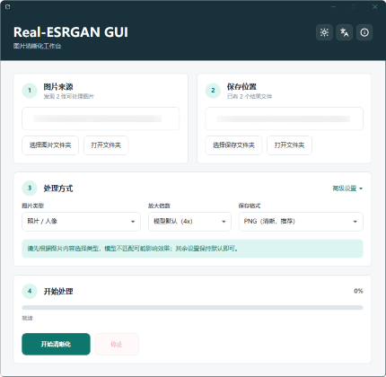
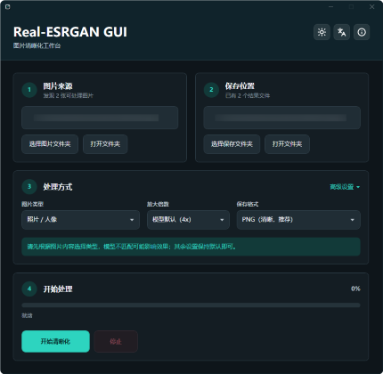

# Real-ESRGAN GUI

**语言选择：[English](README.md) | 简体中文**

**分支说明：** 当前 `dev` 分支用于开发 dev 版本。稳定版本和正式下载请以 `main` 分支及 GitHub Releases 页面为准。

## 项目介绍

Real-ESRGAN GUI 是一个 Windows 图片放大和清晰化工具。它使用随包附带的 Real-ESRGAN NCNN/Vulkan 后端，但你不需要输入命令，也不需要安装 Python、PyTorch、CUDA 或 .NET Runtime。

日常使用很直接：选择图片文件夹，选择输出文件夹，选图片类型，然后开始处理。它适合处理照片、人像、动漫图片、插画和动画帧。

图片会在你的电脑本机处理，不会上传到云端服务。

## 软件截图

| 浅色主题 | 深色主题 |
| :---: | :---: |
| <a href="assets/screenshots/main-window-zh-CN-light.png"></a> | <a href="assets/screenshots/main-window-zh-CN-dark.png"></a> |
| [查看原图](assets/screenshots/main-window-zh-CN-light.png) | [查看原图](assets/screenshots/main-window-zh-CN-dark.png) |

## 许可证和第三方声明

本仓库自己编写的 GUI、启动器、脚本和仓库专属文档使用 MIT License。软件也会随包附带或分发第三方组件，包括 Real-ESRGAN 模型文件、NCNN/Vulkan 后端、.NET runtime 文件和安装器工具。这些第三方组件保留各自原始许可证和署名要求。

完整第三方声明见 [`THIRD_PARTY_NOTICES.md`](THIRD_PARTY_NOTICES.md) 和 [`licenses/`](licenses/) 目录。发布包会包含这些声明文件，软件的“关于”窗口也会展示它们。

## 下载和安装

下面链接始终指向最新版。如果不确定应选择哪个版本，建议下载第一项。

| 你的电脑 | 下载 |
| --- | --- |
| 64 位 Windows 10/11 | [下载 x64 安装包](https://github.com/Xeknoz/Real-ESRGAN-GUI/releases/latest/download/Real-ESRGAN-GUI-Setup-x64.exe) |
| 32 位 Windows 10 | [下载 x86 安装包](https://github.com/Xeknoz/Real-ESRGAN-GUI/releases/latest/download/Real-ESRGAN-GUI-Setup-x86.exe) |
| 64 位 Windows，免安装使用 | [下载 x64 单文件绿色版](https://github.com/Xeknoz/Real-ESRGAN-GUI/releases/latest/download/Real-ESRGAN-GUI-Portable-x64.exe) |
| 32 位 Windows，免安装使用 | [下载 x86 单文件绿色版](https://github.com/Xeknoz/Real-ESRGAN-GUI/releases/latest/download/Real-ESRGAN-GUI-Portable-x86.exe) |

也可以打开 [最新 Release 页面](https://github.com/Xeknoz/Real-ESRGAN-GUI/releases/latest) 查看更新日志和所有文件。

仅使用软件时，请不要下载 "Source code (zip)" 或 "Source code (tar.gz)"。那是给开发者使用的源码包，不是可直接运行的 GUI 软件包。

## 验证下载文件

当前发布二进制未做代码签名。Windows 可能显示 "Unknown publisher" 或 SmartScreen 提示。这是本版本的预期情况；请不要关闭 Windows 安全功能，并先验证下载文件。

验证步骤：

1. 从最新 Release 下载安装包或绿色版。
2. 从同一个 Release 下载 [`SHA256SUMS.txt`](https://github.com/Xeknoz/Real-ESRGAN-GUI/releases/latest/download/SHA256SUMS.txt)。
3. 在文件所在目录打开 PowerShell，运行：

```powershell
Get-FileHash .\Real-ESRGAN-GUI-Setup-x64.exe -Algorithm SHA256
Get-Content .\SHA256SUMS.txt
```

4. 将 PowerShell 输出的 SHA256 与 `SHA256SUMS.txt` 中同名文件的记录进行比对。如果两者不一致，请删除文件并重新下载。

这一步只是确认你电脑上的文件和 Release 里发布的文件一致，不需要 GitHub 账号。

如需查看更完整的发布记录，可以下载 [`release-manifest.json`](https://github.com/Xeknoz/Real-ESRGAN-GUI/releases/latest/download/release-manifest.json)。它会列出 tag、commit、workflow run、文件大小、SHA256 和子模块版本。已经安装 GitHub CLI 的用户，也可以验证来源证明：

```powershell
gh attestation verify .\Real-ESRGAN-GUI-Setup-x64.exe -R Xeknoz/Real-ESRGAN-GUI
```

## 如何使用安装版

1. 运行 `Real-ESRGAN-GUI-Setup-x64.exe`；如果你是 32 位 Windows 10，则运行 x86 安装包。
2. 按安装向导完成安装。
3. 从开始菜单或桌面快捷方式打开 Real-ESRGAN GUI。

安装包已经包含 GUI、启动器、后端程序、.NET 运行时文件、模型和许可证说明。

## 如何使用单文件绿色版

1. 从 Release 页面下载单文件绿色版，例如 `Real-ESRGAN-GUI-Portable-x64.exe`。
2. 将其保存到常规文件夹后运行。
3. 后续可继续从同一文件启动。软件内部文件会被虚拟化，退出时会删除释放出来的临时文件。

## 快速开始

1. 把要处理的图片放进同一个文件夹。
2. 打开 Real-ESRGAN GUI。
3. 点击 `选择图片文件夹`，选择你的图片目录。
4. 点击 `选择保存文件夹`，选择结果保存位置。
5. 选择图片类型。
6. 首次运行时，其他设置可保持默认。
7. 点击 `开始清晰化`。

如果输入文件夹为空，请先放入图片再开始。软件不附带示例输入图。

## 如何选择设置

| 设置 | 实用建议 |
| --- | --- |
| 图片类型 | 真实照片选 `照片 / 人像`，绘画类图片选 `动漫 / 插画`，动画帧选对应的 `动漫视频` 选项。 |
| 放大倍数 | 不确定时保持 `模型默认`。只有需要固定 2x、3x 或 4x 输出时再手动选择。 |
| 保存格式 | 更在意保留质量选 `PNG`，想减小文件选 `JPG`，网页使用可选 `WebP`。 |
| 质量增强 | 建议先普通运行一次。`质量增强` 可能改善部分图片，但速度更慢。 |
| 高级设置 | 线程数和 GPU 建议保持 `自动`，只有排查设备问题时再手动修改。 |

支持的输入文件：`png`、`jpg`、`jpeg`、`bmp`、`webp`、`tif`、`tiff`。

支持的输出格式：`png`、`jpg`、`webp`。

## 用户须知

- 当前发布目标是 Windows 10/11 x64 和 Windows 10 x86。
- 64 位 Windows 请使用 x64 版本。x86 版本内存上限低，主要给 32 位 Windows 10 使用。
- 后端使用 NCNN/Vulkan，建议使用支持 Vulkan 的显卡和较新的显卡驱动。
- 特别大的图片可能处理很久，也可能因为显存不足而失败。
- 正常发布入口是 `Launcher.exe`。它负责显示启动闪屏并打开主界面。

## 与 Real-ESRGAN 的关系

本仓库是围绕 Real-ESRGAN NCNN/Vulkan 后端制作的 Windows GUI 发行版。上游 Real-ESRGAN 项目还包含命令行用法、Python 工作流、模型研究、训练和独立 NCNN 发布包。

相关上游项目：

- [Real-ESRGAN](https://github.com/xinntao/Real-ESRGAN)
- [Real-ESRGAN-ncnn-vulkan](https://github.com/xinntao/Real-ESRGAN-ncnn-vulkan)

## 从源码构建

基础构建环境：

- Windows 10/11 x64
- Git
- PowerShell 5.1 或更新版本
- .NET SDK 9
- Git submodules

完整发布构建还需要：

- Visual Studio C++ Build Tools，包含 x64 和 x86 工具链
- Windows SDK
- CMake 3.10 或更新版本
- Vulkan SDK；构建 x86 时需要 SDK 里有 `Lib32\vulkan-1.lib`，CI 可用 `scripts/setup-vulkan-sdk.ps1 -RequireLib32` 自动安装或选择带该组件的 SDK
- Inno Setup 6；只有生成安装包时才需要
- Enigma Virtual Box；只有生成单文件绿色版时才需要

克隆仓库并初始化后端子模块：

```powershell
git clone --recursive https://github.com/Xeknoz/Real-ESRGAN-GUI.git
cd Real-ESRGAN-GUI
git submodule update --init --recursive
```

如果你已经克隆过仓库，但还没有初始化子模块，只需要运行：

```powershell
git submodule update --init --recursive
```

编译 WPF GUI 项目：

```powershell
dotnet build src/Real-ESRGAN-GUI/RealESRGAN-GUI.csproj
```

构建 x64 便携版目录：

```powershell
.\scripts\build-all.ps1 -Clean -Architecture x64
```

输出位置：

```text
artifacts\portable\x64\
```

构建 Enigma 单文件绿色版：

```powershell
.\scripts\build-enigma.ps1 -Clean
```

默认同时构建两个发布架构。脚本会先生成或复用 `artifacts\intermediate\portable\<arch>\` 下可重新生成的 staging 目录，再把每个便携版目录打包为：

```text
artifacts\portable-enigma\Real-ESRGAN-GUI-Portable-x64.exe
artifacts\portable-enigma\Real-ESRGAN-GUI-Portable-x86.exe
```

如只需单一架构，传入 `-Architecture x64` 或 `-Architecture x86`。

构建两个发布架构和安装包：

```powershell
.\scripts\build-release.ps1
```

完整发布构建默认使用 `artifacts\intermediate\portable\<arch>\` 作为安装包和 Enigma 单文件绿色版的 staging 目录。只有明确需要本地测试可直接运行的目录版时，再使用 `-SkipInstaller` 生成 `artifacts\portable\<arch>\`。

只构建便携版目录，不生成安装包：

```powershell
.\scripts\build-release.ps1 -SkipInstaller
```

构建发布产物并同时生成 Enigma 单文件绿色版：

```powershell
.\scripts\build-release.ps1 -BuildEnigma
```

发布构建完成后，检查可上传的 Release 资产：

```powershell
.\scripts\resolve-release-assets.ps1 -Clean -RequireInstallers -RequireEnigma
```

Release 上传资产就是 `artifacts\installers\` 里的安装包和 `artifacts\portable-enigma\` 里的 Enigma 单文件绿色版。检查脚本只输出这些路径供上传使用，并在传入 `-Clean` 时删除旧的重复目录 `artifacts\release-assets\`。

生成发布哈希和机器可读 manifest：

```powershell
.\scripts\write-release-evidence.ps1 -RequireInstallers -RequireEnigma
```

证据文件会写入 `artifacts\release-evidence\SHA256SUMS.txt` 和 `artifacts\release-evidence\release-manifest.json`。

GitHub Actions 会为数字格式的 `v*` 发布 tag（例如 `v1.0.1` 或 `v1.0.1.4`）发布同一组资产。

只构建单一架构：

```powershell
.\scripts\build-release.ps1 -Architecture x64
.\scripts\build-release.ps1 -Architecture x86
```

常用的单项命令：

```powershell
.\src\Launcher\build.ps1
.\scripts\build-backend.ps1 -Clean -Architecture x64
.\scripts\build-models.ps1
.\scripts\build-all.ps1 -Clean -ForceBackend
.\scripts\build-models.ps1 -Force
.\scripts\build-installer.ps1 -Clean -Architecture x64
.\scripts\build-enigma.ps1 -Clean
```

生成产物都在 `artifacts\` 下：

```text
artifacts\
  backend\<arch>\engine\   生成的后端程序和运行时 DLL
  models\                  生成的 NCNN 模型文件，各架构共用
  portable\<arch>\         build-all 或 -SkipInstaller 生成的可直接运行目录版
  portable-enigma\          由 Enigma Virtual Box 生成的单文件绿色版
  intermediate\portable\<arch>\  安装包和 Enigma 使用的可重新生成 staging 目录
  intermediate\enigma-projects\  可重新生成的 Enigma .evb 中间项目
  installers\              Windows 安装包
```

便携版目录里应包含 `Launcher.exe`、`Real-ESRGAN GUI.exe`、`engine\realesrgan-ncnn-vulkan.exe`、`engine\models\` 下的模型文件、版本标记和许可证说明。

## 试运行本地构建

从源码构建后，如果想试运行软件，可以先生成 x64 和 x86 两套可直接运行的便携版目录：

```powershell
.\scripts\build-release.ps1 -SkipInstaller
```

输出位置：

```text
artifacts\portable\x64\
artifacts\portable\x86\
```

每个架构都从自己的启动器进入软件：

```powershell
.\artifacts\portable\x64\Launcher.exe
.\artifacts\portable\x86\Launcher.exe
```

如果本次构建输出中出现 `NU1900`，构建可能仍然会生成文件，但 NuGet 没有完成依赖包漏洞信息检查。如果这份构建准备分享给别人，请在有网络时重新运行：

```powershell
.\scripts\build-release.ps1 -SkipInstaller -ForceRestore
```

`-ForceRestore` 不是离线修复参数；它只有在能联网时才有意义，作用是强制构建重新获取并检查依赖包信息。

## 面向 Agent 的性能 Trace Skill

仓库公开提供了 [`skills/windows-wpf-trace-analysis`](skills/windows-wpf-trace-analysis/) 这个 Codex Skill，用来分析 Windows WPF 软件的 WPR/WPA/xperf ETL trace。

它适合在修改启动流程、Splash 到主窗口交接、弹窗显示、DWM/GPU 合成、UI delay 或性能相关代码前使用。Skill 会指导 Agent 先导出并比较 trace 证据，再判断问题更像 UI 线程阻塞、DWM/首帧合成、GPU、分页、磁盘 I/O，还是需要继续加临时 ETW 标记。

其中的导出脚本会把 `wpaexporter.exe` 运行时使用的 `LOCALAPPDATA`、`TEMP` 和 `TMP` 临时指向输出目录，避免 WPA 第一次运行时尝试写入真实用户目录或被沙箱拦截：

```powershell
.\skills\windows-wpf-trace-analysis\scripts\export-wpf-trace.ps1 `
  -TracePath .\artifacts\traces\baseline-splash-main-about.etl `
  -OutputDirectory .\artifacts\trace-analysis\baseline
```

完整 WPR、WPA Exporter 和 xperf 命令用法见 Skill 内的 [`references/wpt-command-reference.md`](skills/windows-wpf-trace-analysis/references/wpt-command-reference.md)。

## 许可证

GUI、启动器、脚本和本仓库专属文档使用 MIT License。随包附带的第三方组件保留各自原始许可证和署名，详见 [`THIRD_PARTY_NOTICES.md`](THIRD_PARTY_NOTICES.md)。
